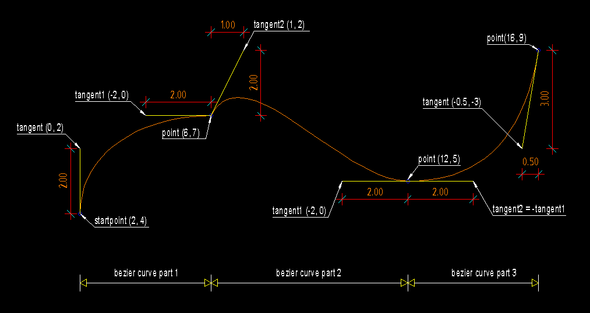

.. _Bezier:

Bezier
======

Type: Composite Entity

Bezier curves are approximated by :ref:`POLYLINE`.

For an explanation of bezier curves see Wikipedia:

http://en.wikipedia.org/wiki/B%C3%A9zier_curve

.. method:: bezier(color=const.BYLAYER, layer='0', linetype=None)

    :param int color: in range [1..255], 0 = `BYBLOCK`, 256 = `BYLAYER`
    :param str layer: layer name
    :param str linetype:  linetype name, if not defined = `BYLAYER`

Methods
-------

.. method:: Bezier.start(point, tangent):

    Set start point and start tangent.

    :param point: 2D start point
    :param tangent: start tangent as 2D vector, example: (5, 0) means a
        horizontal tangent with a length of 5 drawing units

.. method:: Bezier.append(point, tangent1, tangent2=None, segments=20)

    Append a control point with two control tangents.

    :param point: the control point as 2D point
    :param tangent1: first control tangent as 2D vector *left* of point
    :param tangent2: second control tangent as 2D vector *right* of point,
        if omitted tangent2 = -tangent1
    :param int segments: count of line segments for polyline approximation,
        count of line segments from previous control point to this point.

Example
-------

.. literalinclude:: ../../examples/bezier.py
   :lines: 21-51

