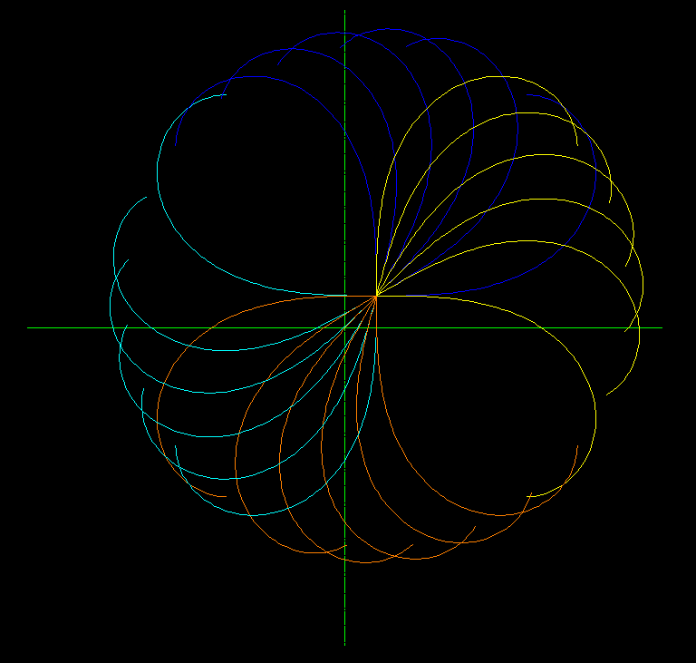

.. _Clothoid:

Clothoid
========

Type: Composite Entity

Clothoid curves are approximated by :ref:`POLYLINE`.

For an explanation of clothoid curves see Wikipedia:

http://en.wikipedia.org/wiki/Clothoid

.. automethod:: dxfwrite.engine.DXFEngine.clothoid

Example
-------

.. literalinclude:: ../../examples/clothoid.py
   :lines: 20-38

