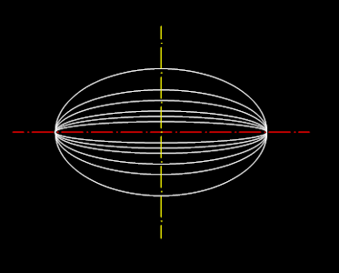
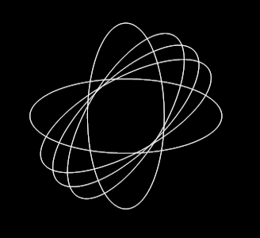
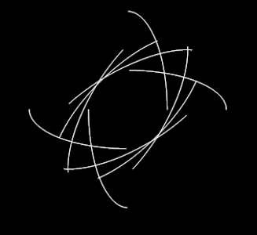

.. _Ellipse:

Ellipse
=======

Ellipse curves are approximated by a :ref:`POLYLINE`.

For an explanation of ellipse curves see Wikipedia:

http://en.wikipedia.org/wiki/Ellipse

.. automethod:: dxfwrite.engine.DXFEngine.ellipse

Example
-------

.. literalinclude:: ../../examples/ellipse.py
   :lines: 20-41

