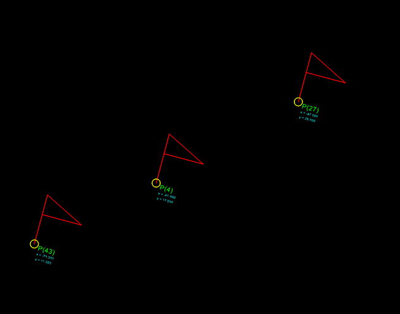

.. _Insert2:

Insert2
=======

Type: Composite Entity

Insert a new block-reference with auto-creating of :ref:`ATTRIB` from
:ref:`ATTDEF`, and setting attrib-text by the attribs-dict.

.. seealso:: :ref:`BLOCK`, :ref:`ATTRIB`, :ref:`ATTDEF`, :ref:`INSERT`

.. method:: DXFEngine.insert2(blockdef, insert=(0., 0.), attribs={}, **kwargs)

    :param blockdef: the block definition itself
    :param insert: insert point (xy- or xyz-tuple), z-axis is 0 by default
    :param float xscale: x-scale factor, default=1.
    :param float yscale: y-scale factor, default=1.
    :param float zscale: z-scale factor, default=1.
    :param float rotation: rotation angle in degree, default=0.
    :param dict attribs: dict with tag:value pairs, to fill the the attdefs in the
        block-definition. example: {'TAG1': 'TextOfTAG1'}, create and insert
        an attrib from an attdef (with tag-value == 'TAG1'), and set
        text-value of the attrib to value 'TextOfTAG1'.
    :param string linetype: linetype name, if not defined = **BYLAYER**
    :param string layer: layer name
    :param int color: range [1..255], 0 = **BYBLOCK**, 256 = **BYLAYER**

Example
-------

.. literalinclude:: ../../examples/flags.py
   :lines: 20-

