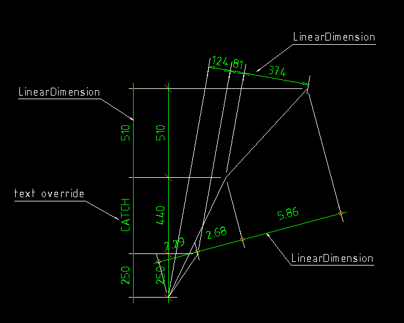

.. _LinearDimension:

LinearDimension
===============

Type: Composite Entity

.. class:: LinearDimension

    Simple straight dimension line with two or more measure points, build
    with basic DXF entities. This is NOT a dxf dimension entity. And This is
    a 2D element, so all z-values will be ignored!

.. method:: LinearDimension.__init__(pos, measure_points, angle=0., dimstyle='Default', layer=None, roundval=None)

    :param pos: location as (x, y) tuple of dimension line, line goes through this point
    :param measure_points: list of points as (x, y) tuples to dimension (two or more)
    :param float angle: angle (in degree) of dimension line
    :param str dimstyle: dimstyle name, 'Default' - style is the default value
    :param str layer: dimension line layer, override the default value of dimstyle
    :param int roundval: count of decimal places

Methods
-------

.. method:: LinearDimension.set_text(section, text)

    Set and override the text of the dimension text for the given dimension
    line section.

Properties
----------

.. attribute:: LinearDimension.section_count

   count of dimline sections

.. attribute:: LinearDimension.point_count

   count of dimline points

Example
-------

.. code-block:: python

   import dxfwrite
   from dxfwrite import DXFEngine as dxf

   # Dimlines are separated from the core library.
   # Dimension lines will not generated by the DXFEngine.
   from dxfwrite.dimlines import dimstyles, LinearDimension

   # create a new drawing
   dwg = dxf.drawing('dimlines.dxf')

   # dimensionline setup:
   # add block and layer definition to drawing
   dimstyles.setup(dwg)

   # create a dimension line for following points
   points = [ (1.7,2.5), (0,0), (3.3,6.9), (8,12)]

   # define new dimstyles, for predefined ticks see dimlines.py
   dimstyles.new("dots", tick="DIMTICK_DOT", scale=1., roundval=2, textabove=.5)
   dimstyles.new("arrow", tick="DIMTICK_ARROW", tick2x=True, dimlineext=0.)
   dimstyles.new('dots2', tick="DIMTICK_DOT", tickfactor=.5)

   #add linear dimension lines
   dwg.add(LinearDimension((3,3), points, dimstyle='dots', angle=15.))
   dwg.add(LinearDimension((0,3), points, angle=90.))
   dwg.add(LinearDimension((-2,14), points, dimstyle='arrow', angle=-10))

   # next dimline is added as anonymous block
   dimline = LinearDimension((-2,3), points, dimstyle='dots2', angle=90.)

   # override dimension text
   dimline.set_text(1, 'CATCH')

   # add dimline as anonymous block
   dwg.add_anonymous_block(dimline, layer='DIMENSIONS')

