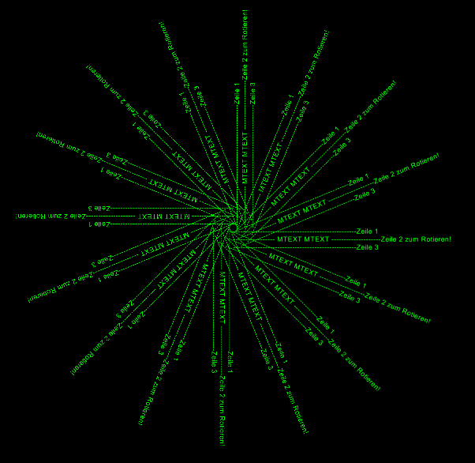
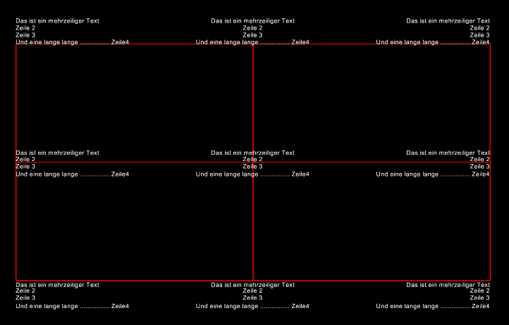

.. _MText:

MText
=====

Type: Composite Entity

* Multiline-Text buildup with simple Text-Entities
* Mostly the same kwargs like :ref:`TEXT`
* Lines are separated by ``'\n'``

Caution: align point is always the insert point, I don't need a second alignpoint
because horizontal alignment **FIT**, **ALIGN**, **BASELINE_MIDDLE** is not
supported by MText.

.. automethod:: dxfwrite.engine.DXFEngine.mtext

Mirror Flags
------------

==============  ===================================
Flag            Description
==============  ===================================
const.MIRROR_X  Text is backward (mirrored in X)
const.MIRROR_Y  Text is upside down (mirrored in Y)
==============  ===================================

Properties
----------

.. attribute:: MText.lineheight

   Lineheight in drawing units.

Attributes of composite DXF entities can **not** be changed by the index operator,
use normal object attributes instead::

    from dxfwrite import DXFEngine as dxf

    drawing = dxf.drawing('drawing.dxf')
    text = dxf.mtext('Line1\nLine2', (1.0, 1.0), height=0.7, rotation=45)
    text.layer = 'TEXT'
    text.color = 7
    drawing.add(text)
    drawing.save()

Example
-------

.. literalinclude:: ../../examples/mtext.py
   :lines: 20-

Various rotation angles:

Different alignment points:

