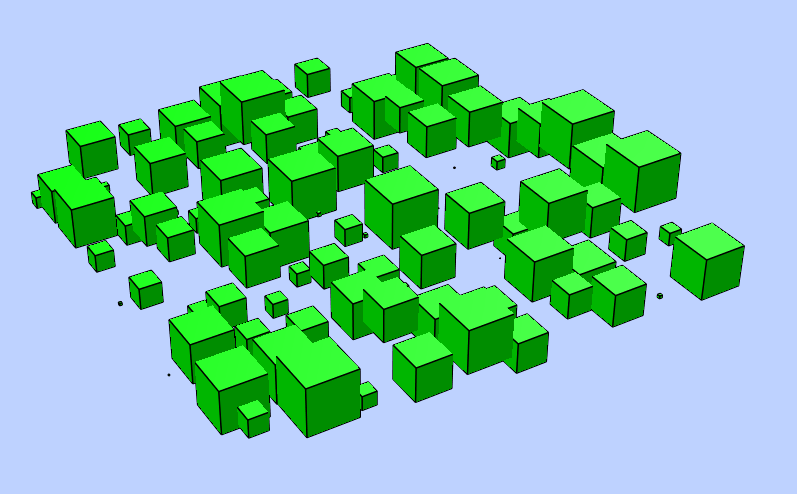

.. _POLYFACE:

POLYFACE
========

Create a new polyface entity, polyface is a dxf-polyline entity!. A Polyface
consist of one or more faces, where each face can have three or four 3D points.

.. method:: DXFEngine.polyface(precision=6, **kwargs)

    :param precision: vertex-coords will be rounded to precision places, and if
        the vertex is equal to an other vertex, only one vertex will be used,
        this reduces filespace, the coords will be rounded only for the
        comparison of the vertices, the output file has the full float
        resolution.

The flags-bit **POLYLINE_POLYFACE** is set.

for **kwargs** see :ref:`POLYLINE`

Methods
-------

.. method:: Polyface.add_face(self, vertices, color=0):

        This is the recommend method for adding faces.

        :param vertices: is a list or tuple with 3 or 4 points (x,y,z).
        :param int color: range [1..255], 0 = **BYBLOCK**, 256 = **BYLAYER**

Example
-------

.. literalinclude:: ../../examples/polyface.py
   :lines: 23-66

