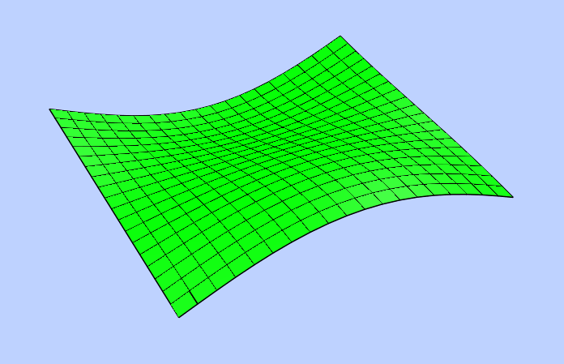

.. _POLYMESH:

POLYMESH
========

Create a new m x n - polymesh entity, polymesh is a dxf-polyline entity!

.. automethod:: dxfwrite.engine.DXFEngine.polymesh

for **kwargs** see :ref:`POLYLINE`

Methods
-------

.. automethod:: dxfwrite.entities.Polymesh.set_vertex

.. automethod:: dxfwrite.entities.Polymesh.set_mclosed

.. automethod:: dxfwrite.entities.Polymesh.set_nclosed

Example::

    import math
    from dxfwrite import DXFEngine as dxf

    msize, nsize = (20, 20)
    dwg = dxf.drawing('mesh.dxf')
    mesh = dxf.polymesh(msize, nsize)
    delta = math.pi / msize
    for x in range(msize):
        sinx = math.sin(float(x)*delta)
        for y in range(nsize):
            cosy = math.cos(float(y)*delta)
            z = sinx * cosy * 3.0
            mesh.set_vertex(x, y, (x, y, z))
    dwg.add(mesh)
    dwg.save()

