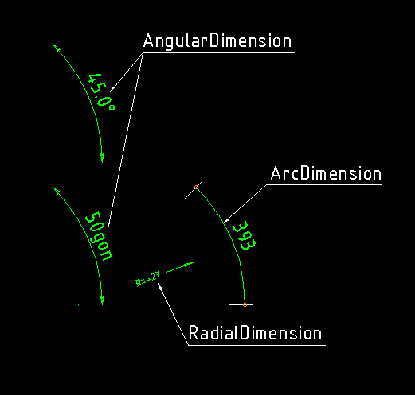

.. _RadialDimension:

RadialDimension
===============

Type: Composite Entity

.. autoclass:: dxfwrite.dimlines.RadialDimension

.. automethod:: dxfwrite.dimlines.RadialDimension.__init__

Example
-------

.. code-block:: python

   import dxfwrite
   from dxfwrite import DXFEngine as dxf

   # Dimlines are separated from the core library.
   # Dimension lines will not generated by the DXFEngine.
   from dxfwrite.dimlines import dimstyles, RadialDimension

   # create a new drawing
   dwg = dxf.drawing('dimlines.dxf')

   # dimensionline setup:
   # add block and layer definition to drawing
   dimstyles.setup(dwg)

   # RadialDimension has a special tick
   dimstyles.new("radius", height=0.25, prefix='R=')
   dwg.add(RadialDimension((20, 0), (24, 1.5), dimstyle='radius'))

