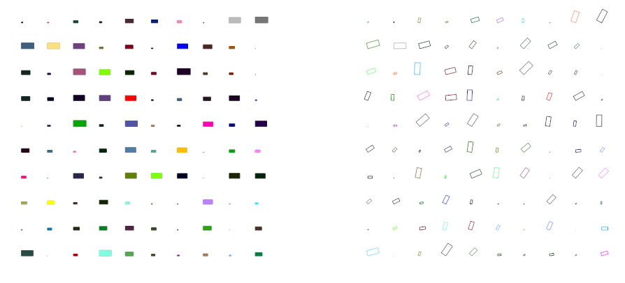

.. _Rectangle:

Rectangle
=========

Type: Composite Entity

2D Rectangle, build with a polyline and a solid as background filling

.. method:: DXFEngine.rectangle(insert, width, height, **kwargs)

    :param point insert: where to place the rectangle
    :param float width: width in drawing units
    :param float height: height in drawing units
    :param float rotation: in degree (circle = 360 degree)
    :param int halign: **LEFT**, **CENTER**, **RIGHT**
    :param int valign: **TOP**, **MIDDLE**, **BOTTOM**
    :param int color: dxf color index, default is **BYLAYER**, if color is None, no
         polyline will be created, and the rectangle consist only of the
         background filling (if bgcolor != `None`)
    :param int bgcolor: dxf color index, default is `None` (no background filling)
    :param string layer: target layer, default is ``'0'``
    :param string linetype: linetype name, None = **BYLAYER**

Example
-------

.. literalinclude:: ../../examples/rectangle.py
   :lines: 22-

