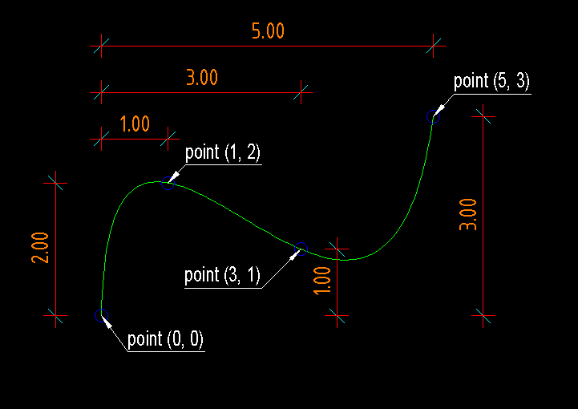

.. _Spline:

Spline
======

Type: Composite Entity

Spline curves are approximated by :ref:`POLYLINE`.

For an explanation of spline curves see Wikipedia:

http://en.wikipedia.org/wiki/Spline_%28mathematics%29

.. method:: DXFEngine.spline(points, segments=100, **kwargs)

    Create a new cubic-spline-entity, consisting of an approximation with a
    polyline.

    :param points: breakpoints (knots) as 2D points (float-tuples), defines the
        curve, the curve goes through this points
    :param int segments: count of line segments for polyline approximation
    :param string linetype: linetype name, if not defined = **BYLAYER**
    :param string layer: layer name
    :param int color: range [1..255], 0 = **BYBLOCK**, 256 = **BYLAYER**

Example
-------

.. literalinclude:: ../../examples/spline.py
   :lines: 20-29

